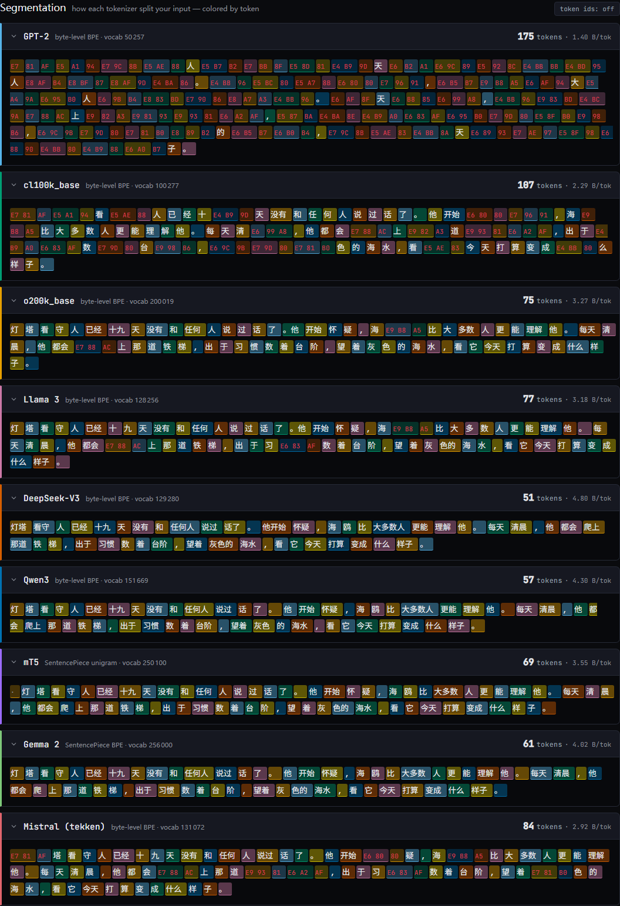

# tokenviewer

_Nine LLM tokenizers, one paragraph — see who pays the token tax. Side by side, in your browser, with cross-tokenizer efficiency analysis._

[](LICENSE) [](.github/workflows/ci.yml) [](tests/) [](https://bettyguo.github.io/tokenviewer/)

**[Live demo](https://bettyguo.github.io/tokenviewer/)** · **[The 30-second story](#the-30-second-story)** · **[How it's verified](#supported-tokenizers)** · **[Privacy](#privacy)** · **[CLI](#command-line-interface)** · **[Contributing](CONTRIBUTING.md)**



_Nine tokenizers, one paragraph. GPT-2 spends 175 tokens on this Chinese passage; DeepSeek-V3 needs 51. Same information, 3.4× the bill._

## The 30-second story

A single 245-byte Chinese passage, run through every tokenizer in the set. Tokens needed:

```
DeepSeek-V3       51  ██████████
Qwen3             57  ███████████
Gemma 2           61  ████████████
mT5               69  ██████████████
o200k_base        75  ███████████████
Llama 3           77  ███████████████
Mistral (tekken)  84  █████████████████
cl100k_base      107  █████████████████████
GPT-2            175  ███████████████████████████████████
                                                          (each █ ≈ 5 tokens)
```

**That's a 3.43× cost gap on identical content.** Within OpenAI alone, the
GPT-2 → o200k progression cut the passage from 175 tokens to 75 — a 57% drop
across tokenizer generations, with no model change. The same dynamic plays out
for Japanese (2.68×), Arabic (3.28×), and Python with type hints (1.57×).
Numbers come from a precomputed reference corpus (`scripts/precompute_baseline.ts`)
regenerated on every build — never hand-entered.

| Sample        | Fewest tokens | Most tokens | Spread |
| ------------- | ------------: | ----------: | -----: |
| English prose |            60 |          77 |  1.28× |
| Chinese       |            51 |         175 |  3.43× |
| Japanese      |            59 |         158 |  2.68× |
| Arabic        |            65 |         213 |  3.28× |
| Swahili       |            83 |         118 |  1.42× |

### Three things stand out

1. **The non-English tax is mostly a tokenizer problem, not a language problem.**
   The same Chinese paragraph is 3.4× more expensive under GPT-2 than under
   DeepSeek-V3. Same information, same Unicode, different merges.

2. **Latin script ≠ free.** Swahili is written in the Latin alphabet, yet the
   _best_ tokenizer spends 83 tokens on it where English fits in 60 — a 38%
   gap that holds across every tokenizer in the set. The cause is
   training-data coverage, not script. This is the tokenizer-fairness effect
   documented by Petrov et al. (2023) and Ahia et al. (2023); see
   [`docs/RESEARCH_BACKDROP.md`](docs/RESEARCH_BACKDROP.md).

3. **The same vendor can fix it.** OpenAI's own progression — GPT-2 → cl100k →
   o200k — went from 175 → 107 → 75 tokens on that Chinese passage. A 57%
   drop, with no model swap, just better tokenizer training.

## Try it

**Easiest — the live demo.** Paste your own text:
**→ [`bettyguo.github.io/tokenviewer`](https://bettyguo.github.io/tokenviewer/)**

**Run it locally.**

```sh
git clone https://github.com/bettyguo/tokenviewer
cd tokenviewer
npm install
npm run setup     # ~43 MB of tokenizer vocab files into public/
npm run dev       # http://localhost:5173
```

**Use the CLI in a shell pipeline.**

```sh
echo "你好,世界!" | npm run tokenviewer
# gpt2     7  1.14  1.86
# cl100k   5  1.60  2.60
# o200k    3  2.67  4.33
# ...
```

The CLI shares the same canonical-verified adapters as the web app. Default
output is TSV (`code  tokens  chars/tok  bytes/tok`) so it pipes into
`awk`/`sort`/`jq` without ceremony. See [the CLI section](#command-line-interface).

## How it compares

|                                           | tokenviewer      | OpenAI tokenizer demo | HF tokenizer playground |
| ----------------------------------------- | ---------------- | --------------------- | ----------------------- |
| Side-by-side cross-tokenizer view         | **yes**          | no                    | no                      |
| Non-OpenAI tokenizers                     | **yes (6 of 9)** | no                    | yes (one at a time)     |
| Analysis layer                            | **4 modules**    | none                  | none                    |
| Precomputed multilingual reference corpus | **yes**          | no                    | no                      |
| Shareable-URL comparisons                 | **yes**          | no                    | no                      |
| Client-side / no text sent to a server    | **yes**          | yes                   | yes                     |

The OpenAI demo and the Hugging Face playground each show one tokenizer at a
time. tokenviewer's point is the _comparison_ — and the analysis layer
underneath it.

## Supported tokenizers

**Every adapter is verified byte-for-byte against the canonical reference:**
Python `tiktoken` for the OpenAI encodings, the Rust `tokenizers` library for
the Hugging Face tokenizers, on the exact `tokenizer.json` the app ships.
177 tests; see [`tests/tokenizers.test.ts`](tests/tokenizers.test.ts).

| Tokenizer        | Family   | Algorithm             | Vocab   | Engine            |
| ---------------- | -------- | --------------------- | ------- | ----------------- |
| GPT-2            | OpenAI   | byte-level BPE        | 50,257  | js-tiktoken       |
| cl100k_base      | OpenAI   | byte-level BPE        | 100,277 | js-tiktoken       |
| o200k_base       | OpenAI   | byte-level BPE        | 200,019 | js-tiktoken       |
| Llama 3          | Meta     | byte-level BPE        | 128,256 | @lenml/tokenizers |
| DeepSeek-V3      | DeepSeek | byte-level BPE        | 129,280 | @lenml/tokenizers |
| Qwen3            | Alibaba  | byte-level BPE        | 151,669 | @lenml/tokenizers |
| mT5              | Google   | SentencePiece unigram | 250,100 | @lenml/tokenizers |
| Gemma 2          | Google   | SentencePiece BPE     | 256,000 | @lenml/tokenizers |
| Mistral (tekken) | Mistral  | byte-level BPE        | 131,072 | @lenml/tokenizers |

Two engines (`tiktoken` and `hf`) cover every adapter; adding a tokenizer that
ships a `tokenizer.json` needs no new engine code — see
[`CONTRIBUTING.md`](CONTRIBUTING.md).

## Privacy

All tokenization happens in your browser. **No text is sent to a server.** No
analytics, no telemetry, no third-party script. After the first load, the only
network requests are same-origin tokenizer data files. A network trace
confirms it — see [`docs/AUDIT_V0.md`](docs/AUDIT_V0.md).

The architecture makes this structurally true, not a policy promise: there is
no backend to send anything to. The privacy guarantee depends only on what
the code does, not on what an operator chooses to do with logs.

## The analysis layer

Four pure-function modules, each shown as a collapsible panel:

- **Efficiency** — token count, chars/token, bytes/token, and each tokenizer's
  count relative to the most efficient one for the current input.
- **Word fragmentation** — how often common English words are kept whole vs.
  split. Reports _not applicable_ (never a misleading 0%) for CJK, Arabic, or
  symbol-heavy input.
- **Cross-tokenizer agreement** — for each position in the input, how many
  tokenizers placed a boundary there; disagreement zones are highlighted.
- **Token-id distribution** — a vocabulary-decile histogram of the ids used,
  a rough hint at how much an input leans on rare merges.

See [`docs/ANALYSIS_LAYER.md`](docs/ANALYSIS_LAYER.md).

## Command-line interface

The same verified adapters are available as a small CLI. Useful in shell
pipelines and CI:

```sh
echo "你好,世界!" | npm run tokenviewer
# gpt2     7  1.14  1.86
# cl100k   5  1.60  2.60
# o200k    3  2.67  4.33

npm run tokenviewer -- "Hello, world." --format table
npm run tokenviewer -- -f README.md --format json | jq '.[] | {code, tokenCount}'
npm run tokenviewer -- --list
```

Default output is TSV (`code  tokens  chars/tok  bytes/tok`) so it pipes
cleanly into `awk`, `sort`, `jq`. `--format table` is human-readable,
`--format json` is structured (add `--detail` for per-token data).

## Develop

```sh
npm install
npm run setup     # downloads tokenizer data + fonts into public/ (required)
npm run dev       # http://localhost:5173
```

`npm run setup` is required before the app will run — `public/tokenizers/` is
not committed (it is ~43 MB of vocabulary files). CI and the deploy workflow
run it automatically.

Other scripts: `npm test`, `npm run check`, `npm run lint`, `npm run build`,
`npm run precompute` (regenerate the reference-corpus results),
`npm run smoke` (headless end-to-end check — needs a running `npm run preview`).

**Before publishing your own copy**, run:

```sh
node scripts/set_repo_url.mjs YOUR_GITHUB_USERNAME
```

This rewrites the `OWNER` placeholder across `package.json`, `index.html`,
this README, and the launch artifacts to point at your fork.

## Contributing

See [`CONTRIBUTING.md`](CONTRIBUTING.md). The highest-leverage contributions
are new tokenizers (with canonical-reference verification), new gallery
samples, and new analysis modules. No analytics, no third-party scripts, no
telemetry — ever; the privacy claim is load-bearing.

## Related work

- **OpenAI tokenizer demo**, **Hugging Face tokenizer playground**,
  **tiktokenizer** (dqbd) — prior interactive tokenizer tools. tokenviewer
  adds the cross-tokenizer comparison and the analysis layer.
- **Andrej Karpathy's "Let's build the GPT Tokenizer"** and **minbpe** — the
  pedagogical companion. tokenviewer is the "here is how the deployed
  tokenizers actually differ" follow-on.
- See [`docs/PRIOR_ART.md`](docs/PRIOR_ART.md) and
  [`docs/RESEARCH_BACKDROP.md`](docs/RESEARCH_BACKDROP.md) for the longer
  survey, including the tokenizer-fairness literature (Petrov et al. 2023;
  Ahia et al. 2023).

## Roadmap

- More tokenizers — a WordPiece model (BERT-family), Phi, recent 2026 releases.
- Batch mode — aggregate statistics over a multi-document paste.
- An embeddable widget for blog posts.
- A "watch BPE merge" mini-demo, in the spirit of Karpathy's lecture.

## Acknowledgements

Built on [js-tiktoken](https://github.com/dqbd/tiktoken) and
[@lenml/tokenizers](https://github.com/lenML/tokenizers) (a tokenizer-only
fork of [transformers.js](https://github.com/huggingface/transformers.js)).
Tokenizer artifacts are the work of OpenAI, Meta, DeepSeek, Alibaba, and
Google. The framing owes a debt to Karpathy's tokenization lecture.

## Citation

```bibtex
@software{tokenviewer,
  title  = {tokenviewer: interactive cross-tokenizer comparison},
  year   = {2026},
  url    = {https://github.com/bettyguo/tokenviewer}
}
```

## License

MIT — see [`LICENSE`](LICENSE).
